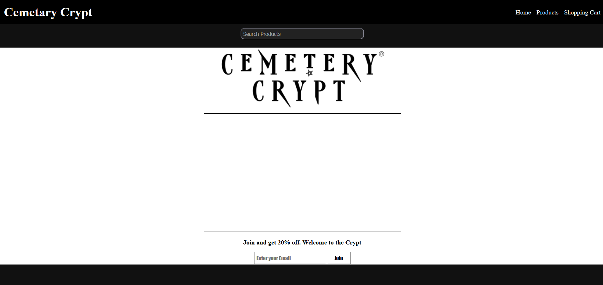
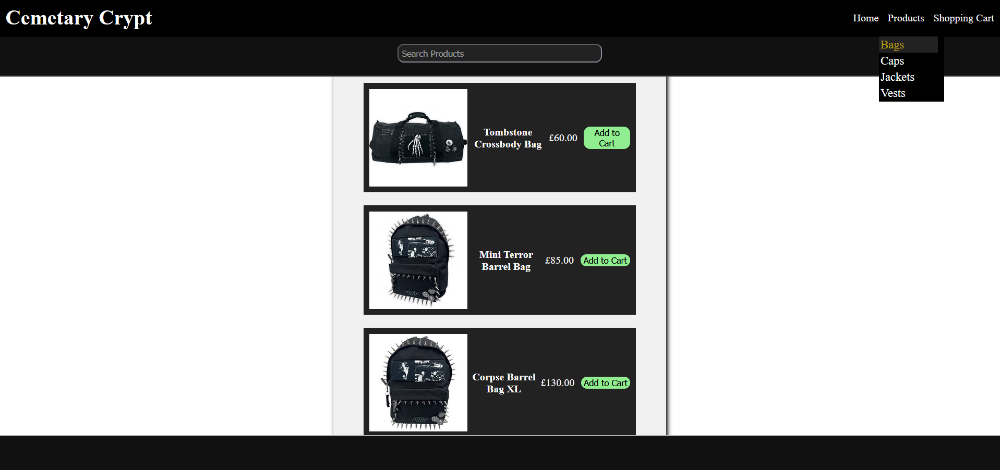

# Capstone project e-commerce site

### Demo
```
will be posted as soon as completed
```
<br>

## Images



<br>



<br>

## Stack/Dependencies
```
- Frontend HTML/CSS/Javascript
- Backend Node.js/express
- dependencies express cors dotenv pg nodemailer stripe openai puppeteer fs
- devDependencies nodemon node-pg-migrate

- Included: within the tools dir, I've included my Puppeteer data scraping function, and the method I used to map the product information to the database.
```

## What I've learned
```
- With this project I've learned how to incorporate Stripe payments.

- I've learned ways to map data I scraped with Puppeteer to batch insert information into my postgres database table.

- Learned about price_in_cents and creating conversion helper tools to map my converted prices to be accepted by Stripe.

- I've learned how to build databases in relation to products and shopping carts.

- Learned how to query more than one table at once with JOIN SQL query to send back data from 2 tables to my frontend.

- Learned how to handle Stripe webhooks upon successful transaction.

- Learned Frontend concepts like stopPropagation and new URLSearchParams for iframes.

```

<br>

---
### BloodLordSoth
[GitHub](http://github.com/BloodLordSoth) | [YouTube](http://youtube.com/@BloodLordSoth)